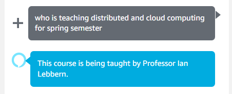
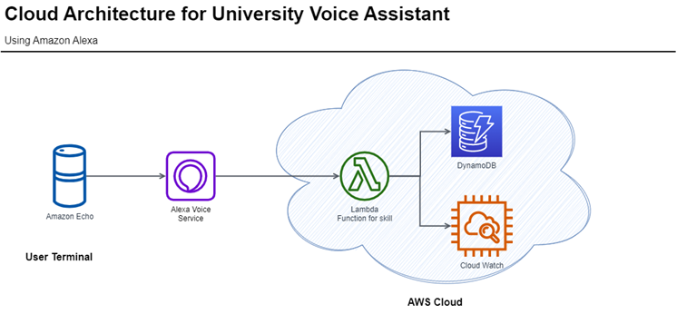
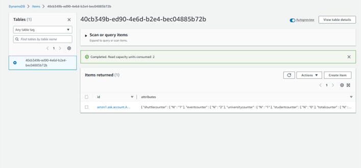
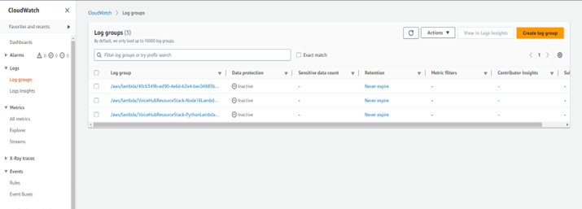

# 🎓 Rutgers University Voice Assistant – Alexa Skill

## 📌 Overview
The **Rutgers University Voice Assistant** is an Alexa Skill designed to help students quickly access campus-related information through natural voice interaction. Built on the **Amazon Alexa Skills Kit (ASK)** and integrated with AWS services, it enables students to check events, food menus, shuttle schedules, academic deadlines, and more — all hands-free.

> 📢 **Now available on the Alexa Skills Store** under the name **"Rutgers University Assistant"**  
> **Author:** Sreya Kambhatla  

---

## ✨ Key Features
- **Voice Commands for Campus Info**: Get details on courses, events, professors, deadlines, shuttle services, and food menus.
- **Persistent Data Tracking**: Stores frequently asked questions and usage metrics in DynamoDB for continuous improvement.
- **Custom Intents**: Six custom intents for specific campus-related queries.
- **AWS Integration**: Uses IAM Roles for secure access, CloudWatch for logs, and DynamoDB for persistent storage.
- **Secure Beta Release**: Passed Amazon’s Alexa certification review before public listing.

---

## 🛠 Architecture
**Core Technologies:**
- **Alexa Skills Kit (ASK)**
- **AWS Lambda (Python 3.6)**
- **DynamoDB** – persistent attributes storage
- **CloudWatch** – monitoring and debugging
- **IAM Roles** – secure access control

**High-Level Flow:**
1. User invokes the skill:  
   `"Alexa, open Rutgers University Assistant"`.
2. Alexa routes the request to AWS Lambda.
3. Lambda executes the corresponding intent handler and optionally queries/stores data in DynamoDB.
4. Alexa responds with the requested information.

---

## 📷 Screenshots

### Example Alexa Conversation

### AWS Cloud Architecture

### DynamoDB Table (Persistent Data Storage)

### CloudWatch Logs (Intent Invocation Monitoring)

---

## 📜 Example Intents
- **EventsInfoIntent** – “What events are happening today?”
- **FoodInfoIntent** – “What’s for lunch at the Gourmet Kitchen?”
- **UniversityInfoIntent** – “When is the final exam period?”
- **StudentInfoIntent** – “What assignments are due this week?”
- **TeacherInfoIntent** – “Who is teaching this course?”
- **ShuttleInfoIntent** – “When is the next shuttle?”

---

## 🔒 Security
- **Certification Approved**: Passed Amazon’s Alexa security guidelines.
- **IAM Roles**: Fine-grained access control for AWS resources.
- **University Access Control**: Designed to integrate with student authentication in future versions.

---

## 🧩 Future Enhancements
- Connect to Rutgers’ live student database for real-time academic info.
- Expand to include management/parental access features.
- Add spending tracking and academic performance analytics.
- Release companion mobile app.
- Integrate with Amazon Echo devices for on-campus deployment.

---

## 👩‍💻 Authors
- **Sreya Kambhatla** – Alexa Skill Development, AWS Integration  
- **Nitya Ramachandran** – Alexa Skill Development, AWS Integration, Documentation

---

**Disclaimer:** This project was created for academic purposes. The simulated student data and campus details are placeholders for demonstration and beta testing.
